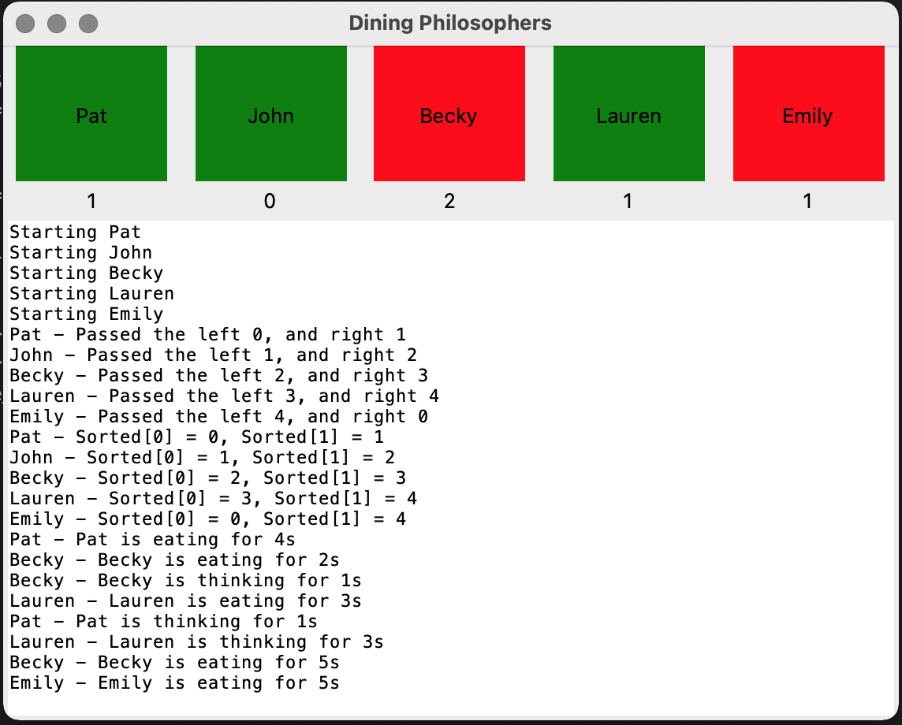

# Dining Philosophers

Here I implements Djikstra's algorithm for solving the dining philosophers problem in rather hacky python. It's nothing special and the code is rubbish but it was useful to visualise what's going on.



## Running
```bash
python main.py
```